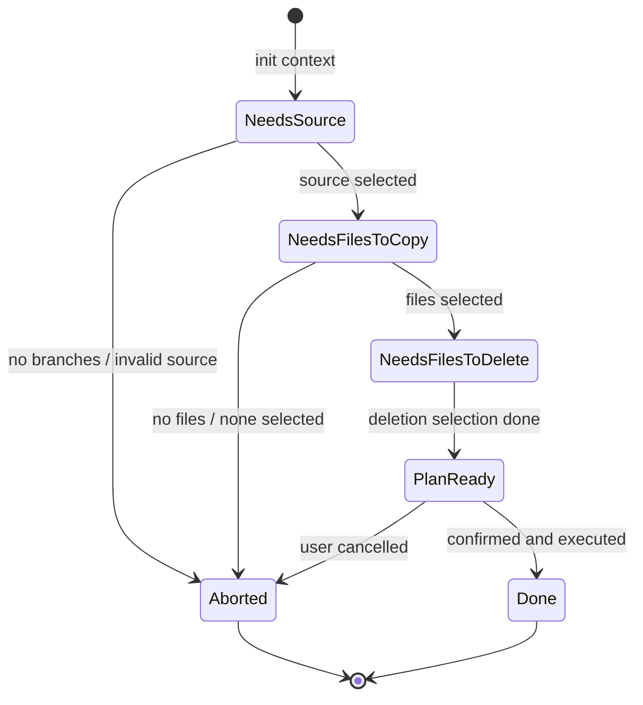

# Implementation Plan - gitx

Build a Node.js-based CLI tool `gitx` that provides extended Git operations, starting with `file-pick`.

## User Review Required

> [!IMPORTANT]
> **Requirements DSL**: We are using **Gherkin (Cucumber)** to formally define requirements in `.feature` files, located in `requirements/`. These will drive our integration tests.

## Architecture: Functional Core, Imperative Shell

The app separates side effects (Git, FS, User Input) from pure logic.

### Directory Structure

```text
src/
├── core/                  # PURE functions only. No side effects.
│   ├── models.ts          # Types (GitFile, Branch, FilePickPlan)
│   ├── file-pick-state.ts # State machine: discriminated union + pure transitions
│   ├── git-parsing.ts     # Git output parsers
│   └── *.test.ts
├── shell/                 # IMPERATIVE. Git, TUI, Process.
│   ├── git.ts             # Git executable wrappers (incl. worktree ops)
│   ├── tui.ts             # Wrapper around @clack/prompts
│   └── file-pick/         # File-pick command
│       ├── FilePickCommand.ts   # State-machine orchestrator
│       ├── execute.ts           # Plan execution (copy + worktree deletion)
│       ├── prompts.ts           # TUI prompts for file-pick
│       ├── index.ts             # CLI command definition (citty)
│       └── *.test.ts
├── test/                  # Test utilities
│   └── git-test-rig.ts    # Temp git repo fixture for tests
├── requirements/          # Gherkin .feature files (Specs only)
├── index.ts               # Entry point
└── ...
```

## State Machine

The `file-pick` command is modeled as a state machine. Each phase produces a well-defined state. The shell layer orchestrates by feeding signals (user inputs, git query results) into pure transition functions.



### State Type

```typescript
type FilePickState =
  | { phase: 'needs-source'; currentBranch: string; branches: Branch[] }
  | { phase: 'needs-file-selection'; sourceBranch: string; currentBranch: string; candidates: GitFile[] }
  | { phase: 'needs-delete-selection'; sourceBranch: string; currentBranch: string; filesToCopy: GitFile[] }
  | { phase: 'plan-ready'; plan: FilePickPlan }
  | { phase: 'aborted'; reason: string }
```

### Pure Transitions

- `initState(currentBranch, branches)` -> `NeedsSource | Aborted`
- `validateSource(state, sourceBranch)` -> `Aborted | undefined`
- `selectSource(state, sourceBranch, candidates)` -> `NeedsFileSelection | Aborted`
- `selectFiles(state, filesToCopy)` -> `NeedsDeleteSelection | Aborted`
- `selectDeletes(state, filesToDelete)` -> `PlanReady`

### Plan

Once all user input is collected, a `FilePickPlan` describes the operations:

```typescript
interface FilePickPlan {
  sourceBranch: string
  currentBranch: string
  filesToCopy: GitFile[]    // copy from source to current, unstaged
  filesToDelete: GitFile[]  // delete from source via worktree
}
```

### Execution

1. **Copy**: For each file, `git checkout <source> -- <file>` then `git restore --staged <file>` (leaves file unstaged).
2. **Delete via worktree** (if any files selected for deletion):
   - `git worktree add <tmpdir> <sourceBranch>`
   - `git rm <files>` (cwd = tmpdir)
   - `git commit -m "gitx: removed files picked into \`<currentBranch>\`"` (cwd = tmpdir)
   - On success: `git worktree remove <tmpdir>`
   - On failure: warn user about the leftover worktree at `<tmpdir>`

## Requirements Engineering

Behavior requirements in `requirements/file-pick.feature`.

## Verification Plan

### Automated Tests

- **Unit**: Pure state transitions in `file-pick-state.test.ts`, parsers in `git-parsing.test.ts`.
- **Integration**: Git wrappers in `git.test.ts`, execution in `execute.test.ts`, command flow in `FilePickCommand.test.ts`.
- **Quality**: `pnpm quality` runs lint, typecheck, tests, and Gherkin lint in parallel.
